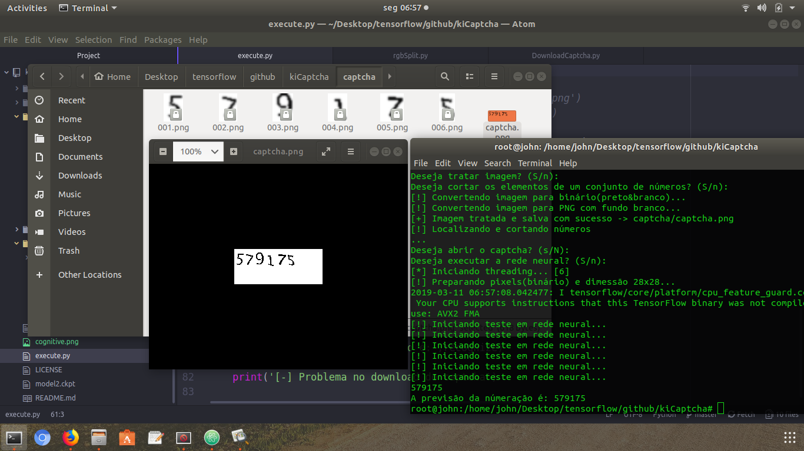

# kiCaptcha

Projeto desenvolvido por Joandeson Andrade e Jessé Silva, estudantes de ciência da computação, UFPB - campus IV, Rio Tinto-PB.
O kiCaptcha tem como objetivo acadêmico e para provar o quando os computadores estão inteligêntes, e que alguns sistemas feito para evitar ataques estão falhando miseravelmente.
Espero que este projeto seja melhorado, estudado, e usado para uma gama maior de tecnologia.

MUITO OBRIGADO!

